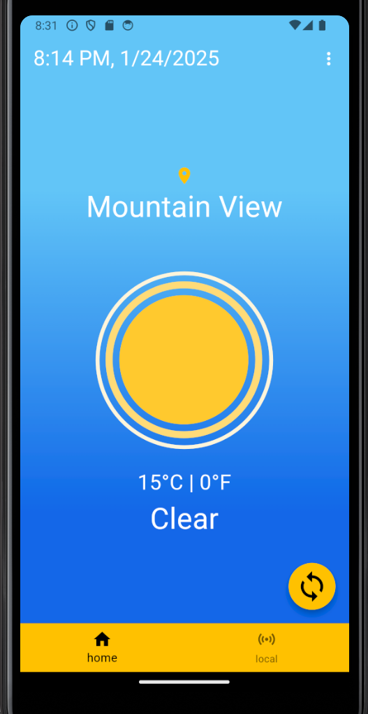
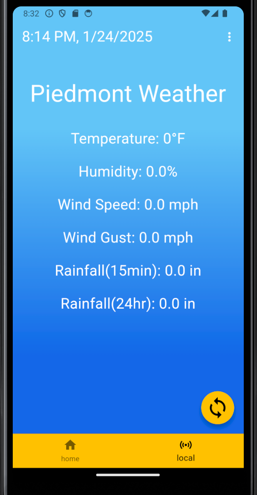
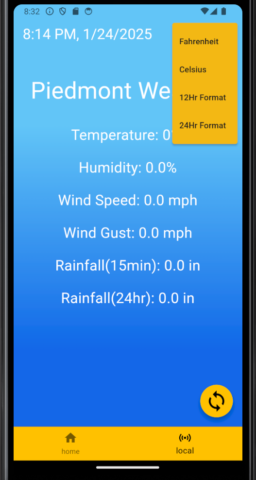

# Weather App

The Weather App is a mobile application created as part of my Mobile Software Development class during my second year of college. This project showcases essential app development skills such as API integration, responsive UI design, and secure API key management using Dart and Flutter. Originally, the app fetched weather data from a local weather API provided by my previous college, but it now uses the OpenWeather API to retrieve weather information based on the user's location.

## 🌦️ **About the App**  
This weather app is designed to provide a seamless and visually appealing user experience:

- Dynamic UI: The app's appearance changes depending on whether it's day or night.  
- Real-Time Weather: Retrieves current weather conditions based on the user's location.  
- Customization: Users can switch between Fahrenheit and Celsius for temperature and toggle between 12-hour and 24-hour time formats.

## 🚀 **Features**  
- 🌍 **Location-Based Weather**: Uses the OpenWeather API to fetch weather based on the user's current location.  
- 🌡️ **Temperature Units**: Toggle between Fahrenheit and Celsius.  
- 🕒 **Time Format**: Switch between 12-hour and 24-hour formats.  
- 🌞 **Day/Night Mode**: Adapts the app's colors and Lottie animations based on the time of day.  
- ❄️ **Lottie Animations**: Displays weather-specific animated icons for conditions like rain, sun, or clouds.  
- 🖋️ **Custom Fonts**: Utilizes Google Fonts for enhanced typography.  
- 🔐 **API Key Security**: Manages sensitive information securely using `.env` files.

## 🛠️ **Technologies Used**  
- **Programming Language**: Dart  
- **Framework**: Flutter  
- **APIs**: OpenWeather API (to fetch weather data)  
- **Libraries**:  
  - `flutter_dotenv` (for managing API keys)  
  - `http` (for API requests)  
  - `geolocator` (to get user location)  
  - `google_fonts` (for custom fonts)  
  - `lottie` (for weather animations)  
  - `geocoding` (to translate coordinates into readable locations)

## 📦 **Installation and Setup**  
To run the Weather App on your local device, follow these steps:

1. **Clone the repository**:  

   ```bash
   git clone https://github.com/DaveTron4/Weather-App.git
   cd Weather-App

2. **Install dependencies**:
    
    Make sure you have Flutter installed, then run:

    ```bash
    flutter pub get
    ```

3. **Add your OpenWeather API key**:
    
    Create a `.env` file in the root of your project and add your API key:

    ```bash
    OPENWEATHER_API_KEY=your_api_key_here
    ```   

4. **Run the app**:
    
    Launch the app on your device or emulator:
    ```bash
    flutter run
    ```

## 🎓 **Learning Outcomes**  
This project helped me:

- Gain experience using Flutter to build mobile applications.
- Integrate external APIs (OpenWeather) to fetch real-time data.
- Secure sensitive information (API keys) with `.env` files.
- Enhance user interfaces with Lottie animations and Google Fonts.
- Explore responsive design techniques for day/night modes and weather conditions.

## 🖼️ Screenshot





## 📜 **License**  
This project is open source and available under the MIT License.

## 🤝 **Contributing**  
Feel free to fork this repository, submit issues, or suggest improvements! Contributions are always welcome.